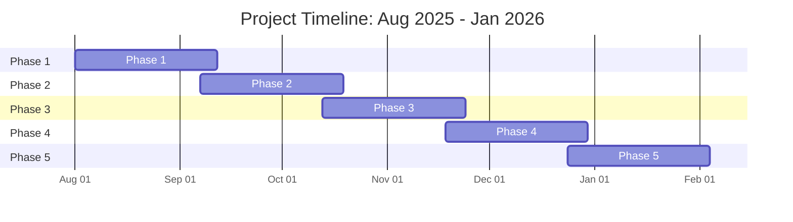

# Web OS in Javascript

Estoy desarrollando un sistema operativo como interfaz principal HTML, CSS y la logica de Javascript.

Estamos actualizandolo para mejores cambios.

## Diagrama de Gantt del Proyecto

### Fases del Proyecto:

- **Planificación**: Análisis inicial y definición de requisitos
- **Desarrollo Frontend**: Creación de la interfaz HTML/CSS
- **Desarrollo Backend**: Implementación de la lógica en Javascript
- **Integración**: Unificación de componentes y testing final
